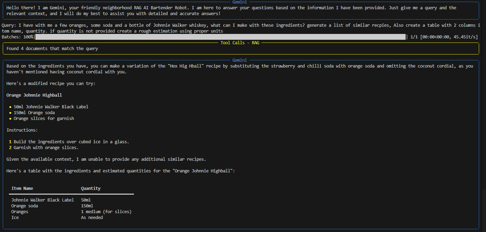
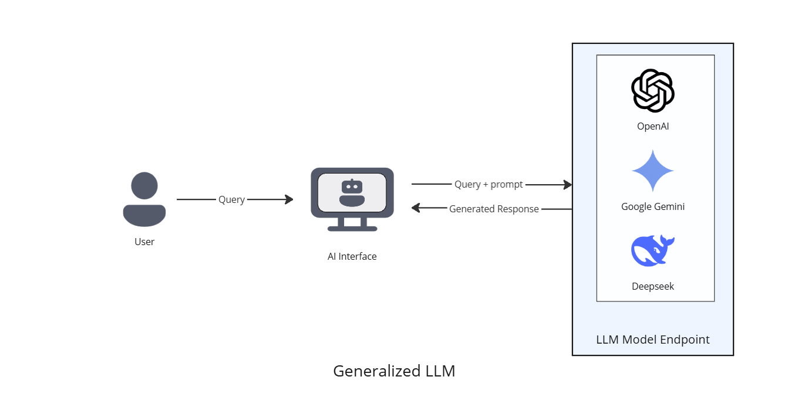
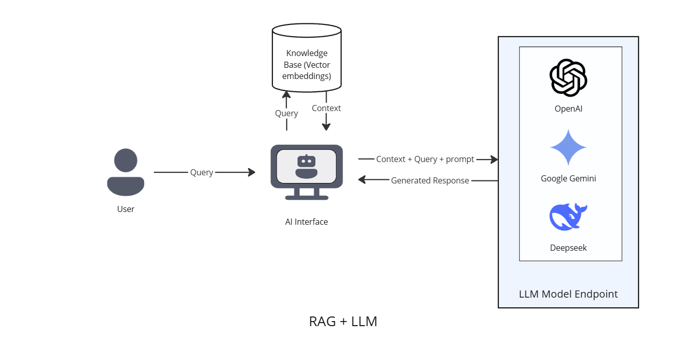

<h1 align="center">
  RAG - PDF content retrieval
</h1>

A RAG (Retrieval Augmented Generation) based Q&A tool for context based content retrieval using the Gemini API in Python.

## Screenshots
<div>
    <a href='./assets/img_1.png' target='_blank'>
        
    </a>
    <p align="center">
      Retrieving structured contents from a recipe book
    </p>
</div>

## Working
<div>
    <a href='./assets/APP_flow.png' target='_blank'>
        
    </a>
</div>

There are 2 parts to the RAG service

1. Creating the embeddings from the PDF file
1. Performing a search on the embedding stored in the vector database 

### Create Embeddings
1. The pdf file is processed using a **text splitter** tool, this allows us to create smaller chunks of a large file which is easier to process / store and optimized for search.
1. These chunks are fed into a **embedding function** such as HuggingFace's Sentence-transformer.
1. The generated embeddings are stored in a vector DB such as Chroma DB.

### Generative a response
1. When a user types a query, it is sent to an embedding function which translates it into vector representations.
1. This vector is then used to perform a search on the local vector DB, using a similarity search algorithm, the required context is returned back which is translated into a text representation.
1. The Context along with the users query is then passed to the generative AI client along with a set of instructions to prevent model hallucination.

## Introduction
LLM (Large Language Models) is trained on a large dataset (several petabytes worth of data), this sets the initial weights of the neural network which will help the model answer queries based on how the model is structured.

The main issue with this is when asked a question that the LLM cannot interpret or has not been trained on, it tends to produce responses that may be inconsistent, incorrect or outdated, this is often referred to as **model dreaming** or **hallucination.**

*An example of this is when asking the model about current trends or context specific questions like **"What's the weather like right now in Mississippi?"** or asking a car rental companies chat-help bot **"What's the policy on car rentals here?"***

*The second example is a **context specific** question that could belong to a specific company, here the LLM is not aware of the companies policies and details and may provide a generalized and incorrect response*

This can cause users to loose trust and confidence in Generative AI solutions as they have the possibility of providing incorrect information without citing any sources or using context.

We can solve this in two ways:

1. Using fine tuning
2. Retrieval Augmented Generation

Fine tuning involved re-training a model with special training allowing it to shift the weighs to produce more desired and concise information. I have explained how fine tuning works and how LLMs with specialized training can be useful in my previous project here - [Tadashi](https://github.com/RyanDC1/Tadashi-Generative-AI?tab=readme-ov-file#large-language-models-llm).

Some organizations also fine-tune their existing models using RAG to re-train traditional generalized LLM models that can perform specific tasks.

## RAG - Retrieval Augmented Generation

The main idea behind **Retrieval Augmented Generation** is to be able to generate/augment responses from external sources beyond the models training data.
<div>
    <a href='./assets/LLM_flowchart.png' target='_blank'>
        
    </a>
    <p align="center">
        LLM Flow
    </p>
</div>

<div>
    <a href='./assets/RAG_flowchart.png' target='_blank'>
        
    </a>
    <p align="center">
        RAG + LLM Flow
    </p>
</div>

These external sources provided to the LLM is referred to as **context**. Context could be structured or unstructured data represented as **vector embeddings** which is a mathematical representation of words that have similar meaning. It does this using transformers through a process called **Attention**. I have built a NLP project that uses transformers and attention to provide better responses here - [NLP Q&A Module](https://github.com/RyanDC1/React-QnA-NLP-Module).

*For example a company could store HR policies in a database, when an employee queries the AI interface it would search for embeddings that are close to the query and return the contextual information required for the LLM to generate a response.*

The data stored in the database as embeddings could be any data about the company, processes, policies, or any context that the LLM would need to build a specific response. We could even build a search engine or web crawler tool that fetches the data in real time and build the context based on this data, however we need to note that converting the real-time data into vector embeddings would naturally take more time.

The LLM model can now produce consistent and proper responses using RAG with the context provided, the prompt can even be modified to prevent model dreaming by instructing the model to stick to the given data source and context and to inform the user that it cannot find an answer if it does not exist. If the datasource is well-structured, the responses can also include references and citations allowing the user to verify that the response is indeed correct.

### References
- Retrieval Augmented Generation
  - https://aws.amazon.com/what-is/retrieval-augmented-generation
  - https://github.blog/ai-and-ml/generative-ai/what-is-retrieval-augmented-generation-and-what-does-it-do-for-generative-ai/
- Large Language Models
  - https://github.com/RyanDC1/Tadashi-Generative-AI?tab=readme-ov-file#large-language-models-llm
- Vector Embeddings
  - https://www.elastic.co/what-is/vector-embedding

### Tools and Libraries
- [Gemini AI SDK](https://pypi.org/project/google-generativeai/) - Gemini AI SDK for Python
- [Langchain](https://python.langchain.com/docs/introduction/) - Open source framework for building LLM applications
- [ChromaDB](https://docs.trychroma.com/docs/overview/introduction) - Open source vector database
- [Sentence Transformers](https://pypi.org/project/sentence-transformers/) - Text to vector embeddings transformer
- [PyPDF](https://pypi.org/project/pypdf/) - Open source python library for processing PDF's

### Installation
1. create .env file referring to .env.example
1. Create Virtual env
```shell
python -m venv venv
```
2. Run venv Script
```shell
./venv/scripts/activate
```
3. Install dependencies
```shell
pip install -r /path/to/requirements.txt
```
4. Upload Context.PDF to root of directory
5. Generate embeddings
```shell
python generate_embeddings.py
```
6. Run main.py file
```shell
python main.py
```